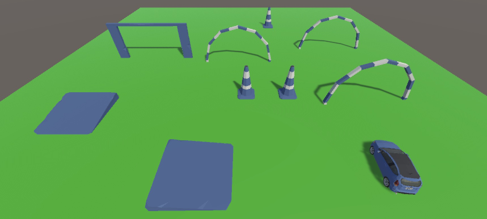
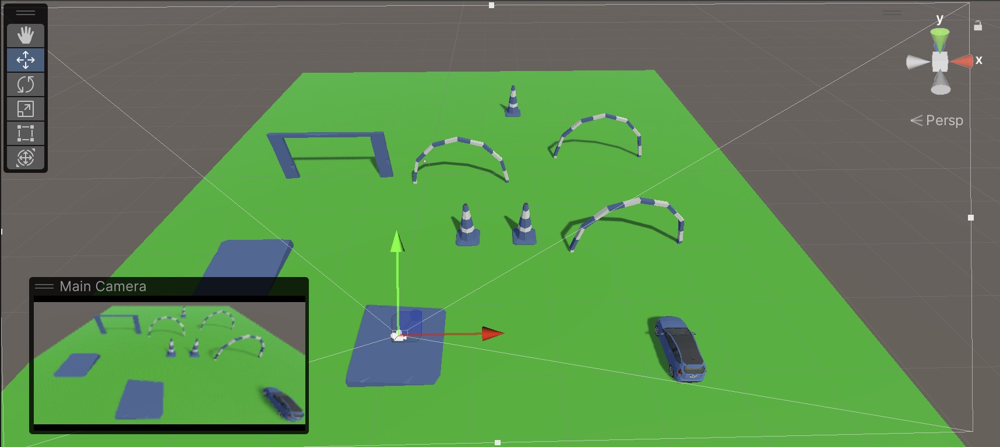

# 🚗 Automotive Game


*<p align="center">A sample in-game screenshot showing the main vehicle and environment.</p>*


*<p align="center">Another gameplay moment: drive, explore, and have fun!</p>*

---

## 🛠️ Project Overview

**Automotive** is a Unity-based 3D vehicle movement demo project. It demonstrates how to control a car-like object using keyboard input, simulating remote-control (RC) car movement. The project is designed for learning, prototyping, and as a base for more advanced vehicle or driving games.

---

## ✨ Features
- 🚙 Smooth RC-style vehicle movement (forward, backward, turn left/right)
- 🎮 Keyboard controls (arrow keys)
- 🖥️ Simple UI overlay for status display
- 🧩 Modular C# scripts for easy extension
- 🏞️ Ready-to-use Unity scene and assets

---

## 🏗️ Tech Stack & Frameworks
- **Unity 2022.3.x** (LTS recommended)
- **C#** scripting
- Unity built-in packages:
  - TextMeshPro
  - Timeline
  - Visual Scripting
  - uGUI
  - Physics & Physics2D
  - Vehicles module
- Project structure follows Unity best practices

---

## 🚀 Getting Started

1. **Clone the repo:**
   ```bash
   git clone https://github.com/pakmingc/Automotive.git
   ```
2. **Open in Unity Hub:**
   - Use Unity 2022.3.x or newer.
   - Open the project folder.
3. **Play the Scene:**
   - Open the main scene in `Assets/Scenes/`.
   - Press ▶️ to play.
   - Use arrow keys to control the vehicle.

---

## 📂 Project Structure
```
Assets/
  Scripts/         # C# scripts (VehicleMover)
  Scenes/          # Unity scenes
  Materials/       # Materials for rendering
  PolygonStarter/  # Starter assets
image/             # Game screenshots
```

---

## 🧑‍💻 Key Scripts
- **VehicleMover.cs**  
  Handles all vehicle movement logic (forward/backward/turning) using keyboard input.
- **HelloWorld_2.cs**  
  Example script for UI and state display.

---

## 🙌 Credits
- Developed by [pakmingc](https://github.com/pakmingc)
- Inspired by Unity Learn and open-source vehicle demos

---

## 📸 Screenshots
See above for in-game visuals!

---

## 📝 License
MIT License. See [LICENSE](LICENSE) for details.

---

> Like this project? ⭐ Star it on GitHub!
